# Web_VideoEditing
# Building an Online Video Editing Website
Building an online video editing website with the aim of providing users with a convenient tool to create and edit their videos. The platform will offer features such as audio editing, video cutting, format conversion, and more.

## Installation Guide
- Installing Xampp: You can download the latest version. Link download: https://www.apachefriends.org/download.html
- Installing Python: We are using Python 3.10. Link download: https://www.python.org/downloads/release/python-3100/
- Install libraries:
  + OpenCV: pip install opencv-python
  + Moviepy: pip install moviepy
  + FFMPEG: https://ffmpeg.org/download.html
  + Pydub: pip install pydub
  + ImageMagick: https://imagemagick.org/script/download.php

## Technologies Used
- Python
- Django
- Bootstrap
- JavaScript
- Ajax

## Main editing tools include:
- Cut videos
- Merge videos
- Crop video
- Loop Video
- Add voice to video
- Add Subtitles to video

## System Functions
- User functions:
    + Login - Signup: First, users register for an account. Then, the user logs in to the website using the registered account with role="client" access rights.
    + Edit information: Users can view and edit their personal information.
    + Choose a video editing tool: After successfully logging in, users choose editing tools such as cutting video, merging video, looping video, cropping video, adding voice to video, add subtitles to video.
    + Upload a video: After selecting an editing tool, users can upload a video to that page.
    + Preview the video: Users can preview the edited video before exporting and saving.
    + Export video: After previewing the video, users can export the video and save it.
    + Personal project management: Users can create, manage, and store different video-edited projects.
- Administrator functions:
    + Login: manage the entire system.
    + User management: Administrators have permission to manage user accounts including viewing, updating, or deleting accounts.
    + Content management: Administrators can view and manage user videos including deleting videos.

## Usage
    python web_videoediting/manage.py makemigrations
    python web_videoediting/manage.py migrate
    python web_videoediting/manage.py runserver
    In your web browser enter the address: http://localhost:8000 or http://127.0.0.1:8000/

## Demo
* Administrator interface
User management page

Function to add User
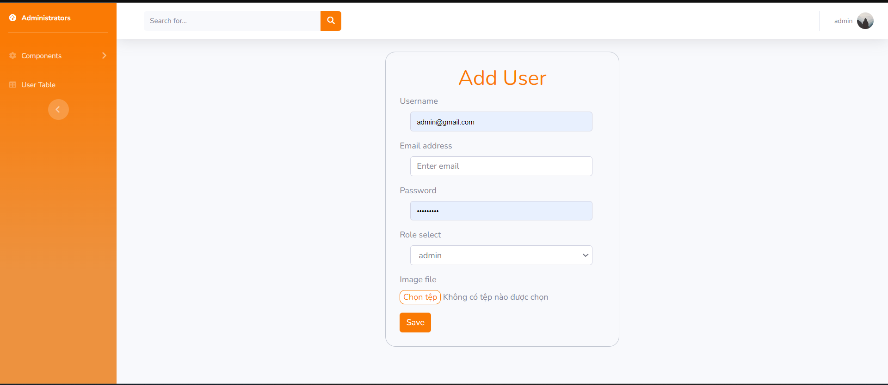
Delete user videos
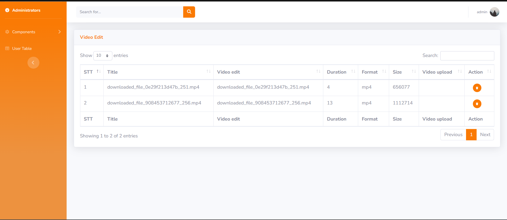

* User interface
Account registration page
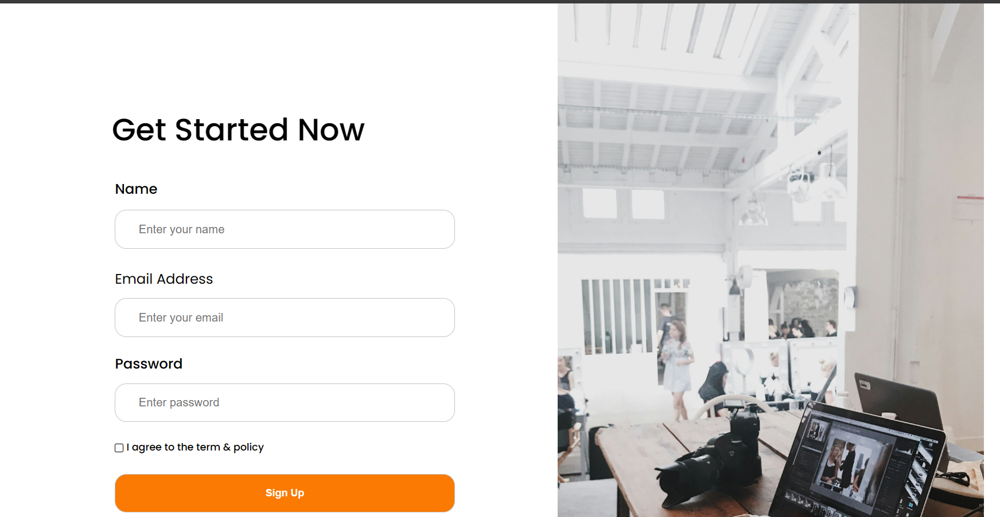
Account login page

Home page
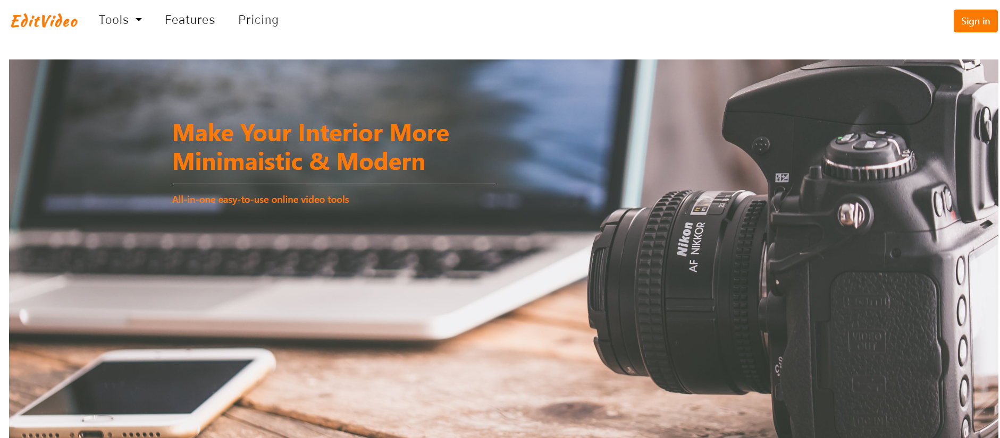
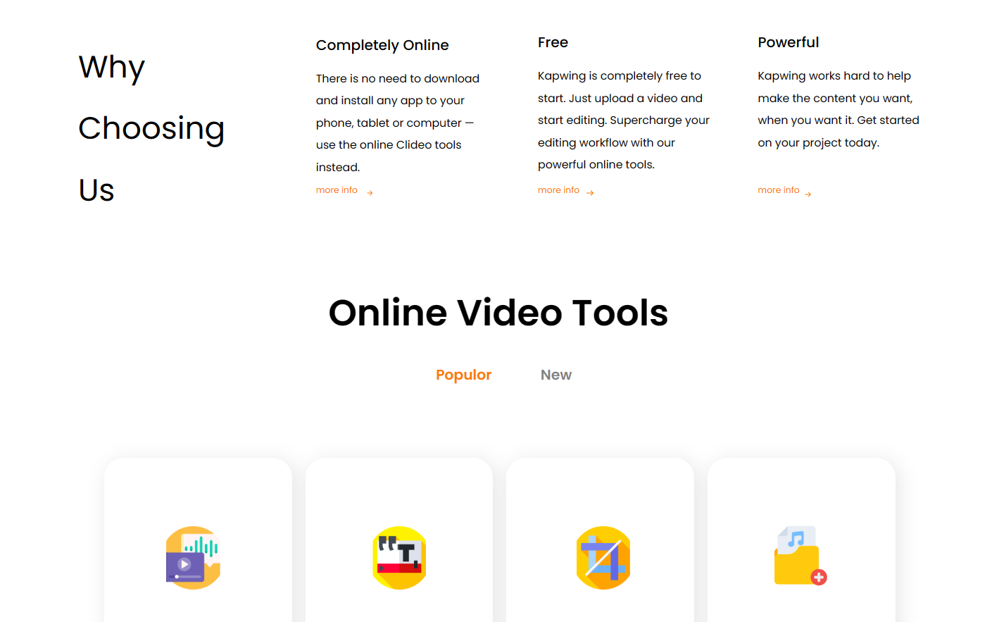
The page displays video editing tools
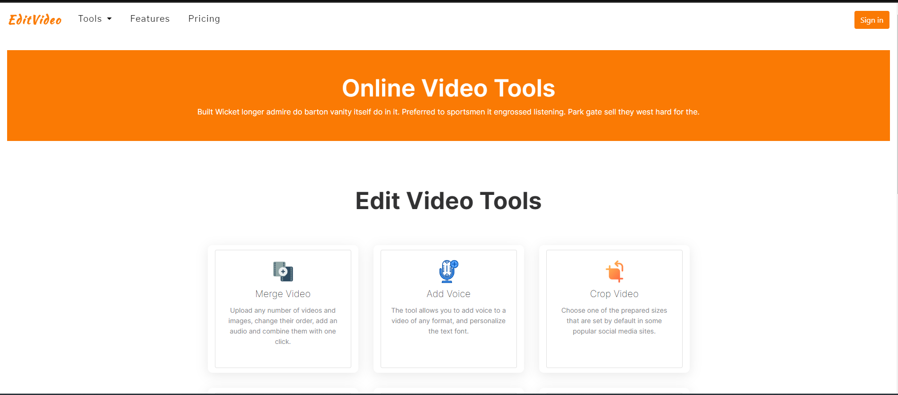
Cut videos Page
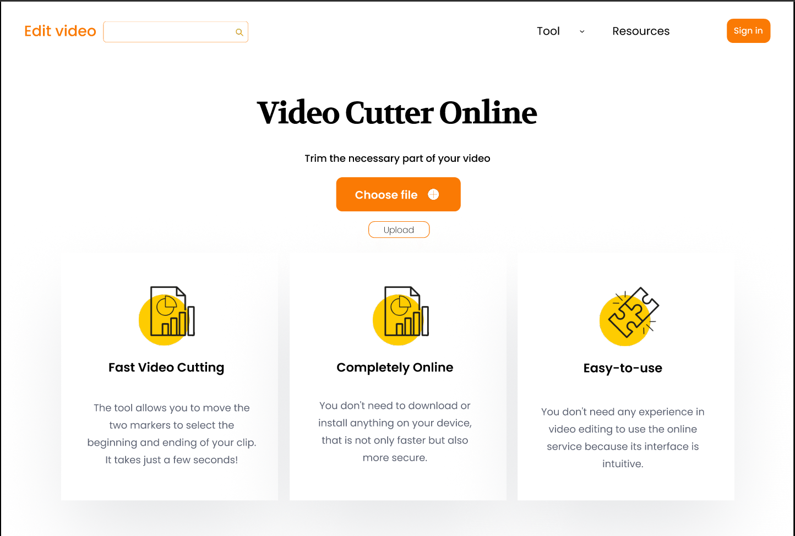
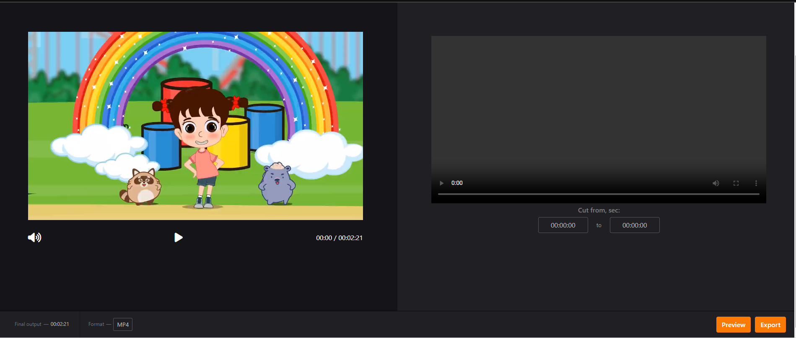
Merge videos Page
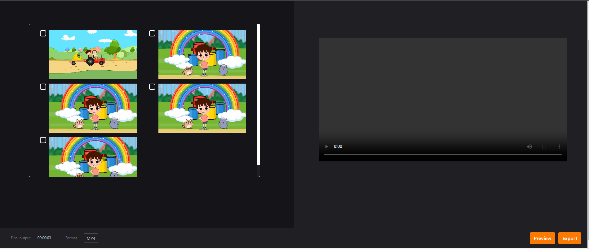
Crop Video Page
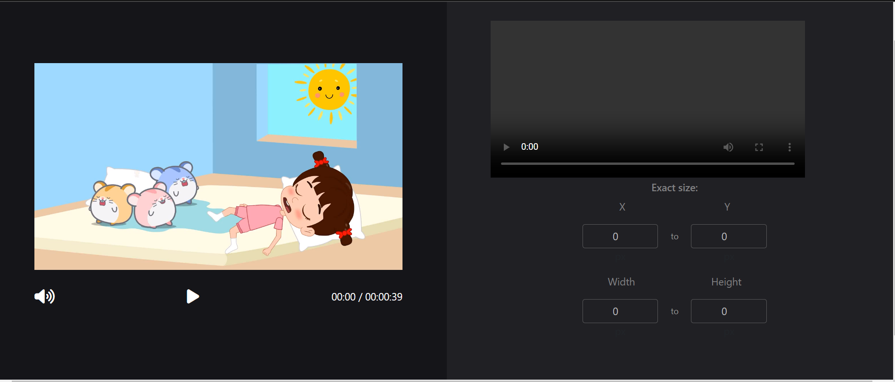
Add Voice To Video Page
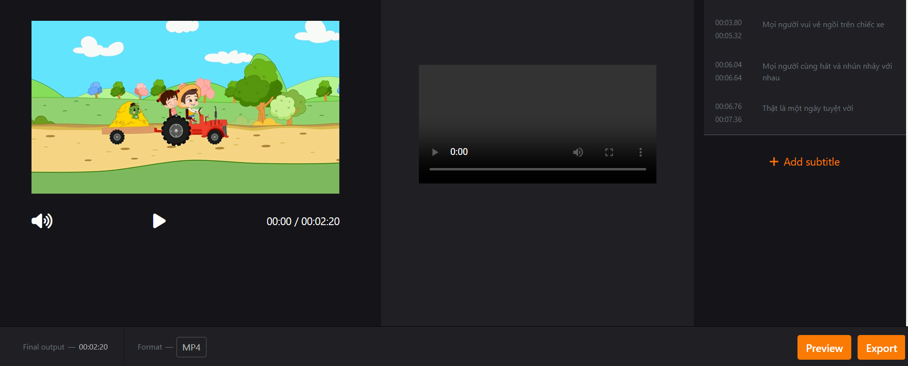
Loop Video
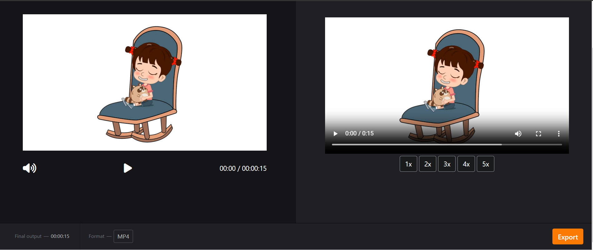
Add Subtitles to Video Page
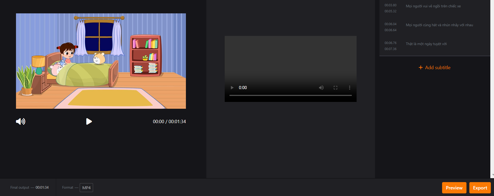

* Personal project management page
Video Management
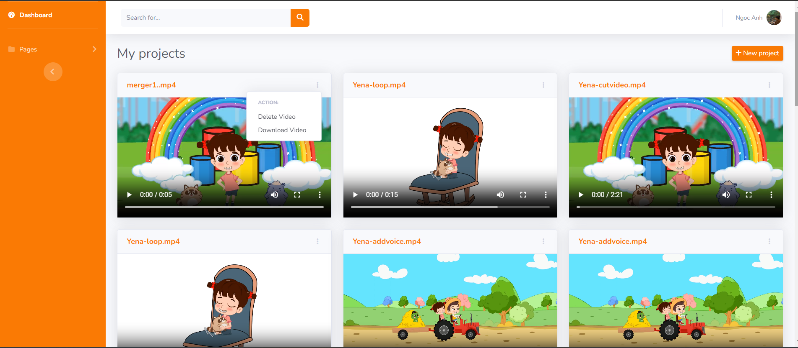

